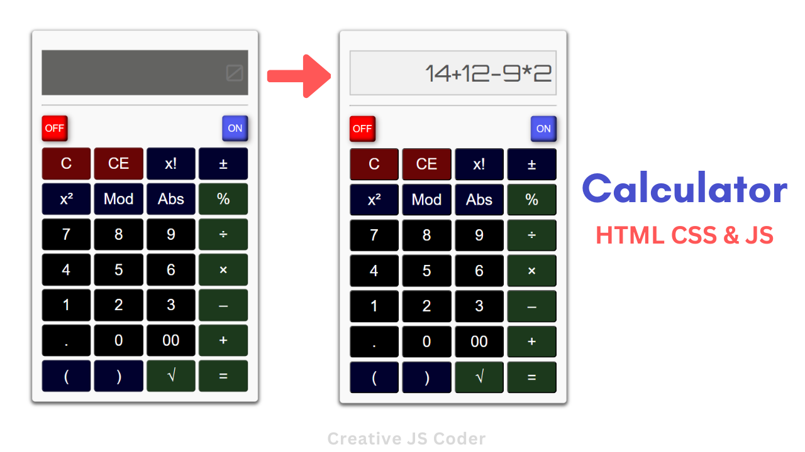

## Hi there 👋, my name is Mohammed Faysal
### I am a Web Developer and a YouTuber

__Iam a Teacher and I am a Learner__

 

__Skills and Experience:__
- ⚛ React
- 💻 HTML, CSS, SCSS, Bootstrap, Tailwind CSS
- 👩‍💻 JavaScript, jQuery

 

## Example of my Work
     
       

 

 🔭 I’m currently working on YouTube  
 🌱 I’m currently learning JavaScript   
 👯 I’m looking to collaborate on GitHub   
 💬 Ask me about Web Development 

 

    

 

     

  

  

  

  

  
